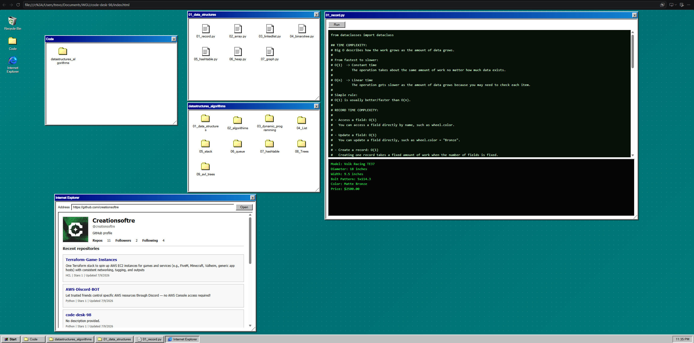

# Data Structures & Algorithms Desktop

An interactive, Windows 98-inspired showcase of what I am learning about data structures and algorithms during my master's degree at Western Governors University (WGU).



## About the project

This repository started as a place to keep my code, explanations, and practical use cases. I like connecting technical ideas to familiar things, such as Japanese-inspired wheels, to make each data structure and algorithm easier to explain and visualize.

As I shared what I was learning with friends and coworkers, I wanted to give them something more engaging than a collection of source files. That idea became this interactive desktop: visitors can explore folders, open examples, read the code, and run Python directly in the browser.

The desktop also includes a course-study quiz template with competency scores, topic-level feedback, answer explanations, weak-area practice, and attempt history saved locally in the browser. The question bank is being developed from course-aligned source material.

The project is a growing record of my learning, not a finished reference guide. I will continue adding examples and improving the visual experience as I progress through my degree.

## Topics

- Core data structures
- Searching and pathfinding algorithms
- Greedy algorithms and heuristics
- Dynamic programming
- Hash tables
- Trees, binary search trees, and AVL trees
- Explanations, examples, and real-world use cases

## Running locally

Because the desktop loads its file system data in the browser, serve the project through a local web server instead of opening `index.html` directly.

For example, with Python installed:

```bash
python -m http.server 8000
```

Then visit [http://localhost:8000](http://localhost:8000).

## Inspiration and credits

- The interactive desktop concept was inspired by [SK Career OS on Perplexity](https://www.perplexity.ai/computer/a/sk-career-os-zOn5HDHLSeGME9wQqn2TSg).
- Windows 98 icons are from [Windows 98 Icon Viewer by Alex Meub](https://win98icons.alexmeub.com/).

## Note

This is a personal educational project created to document and share my understanding. The examples reflect my learning process and may evolve over time.
